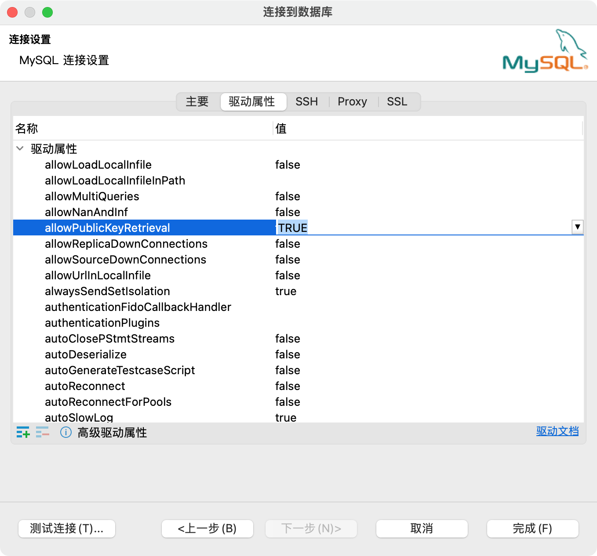

在`Docker`部署`NextCloud`服务，并使用`MySQL`和`Redis`做数据库。

<!-- more -->

## 背景

由于最近[icloudpd](https://github.com/boredazfcuk/docker-icloudpd)在国内无法正常运行同步`icloud`照片，遂寻找替代方案。经过一段时间时间的筛选，最后决定使用`NextCloud`项目部署服务。[NextCloud](https://nextcloud.com/)是一套主打安全、合规的开源私有云存储项目。

此次的部署用的`Docker`环境，使用`MySQL`做数据库，利用`Redis`做服务缓存加速。

## 自定义`Docker`网络

由于后面各个容器之间需要通信，所以提前准备自定义网络。

```bash
docker network create nextcloud --driver bridge
# nextcloud 是自定义网络名，可以随便取
# --driver 指定网络模式
```

|网络模式   |简介        |
|:----|:---------------|
|bridge        |为每一个容器分配、设置`IP`等，并将容器连接到一个`docker0`虚拟网桥，默认为该模式。|
|host          |容器将不会虚拟出自己的网卡，配置自己的`IP`等，而是使用宿主机的`IP`和端口。|
|none          |容器有独立的`Network namespace`，但并没有对其进行任何网络设置，如分配`veth pair`和网桥连接，`IP`等。|
|container     |新创建的容器不会创建自己的网卡和配置自己的 IP，而是和一个指定的容器共享`IP`、端口范围等。|


## 安装`MySQL`

### 1.拉取镜像

```bash
docker pull mysql:8.0.33
```

### 2.启动服务

```bash
docker run -d --privileged=true --name mysql \
-v /mysql/data:/var/lib/mysql \
-e MYSQL_ROOT_PASSWORD=yourMysqlPwd \
--network nextcloud -p 3306:3306 mysql:8.0.33

# --name mysql 容器名字可以随意定义，这里一定要加！后面容器间通行会用到
# /mysql/data 宿主机目录，用来做mysql容器数据持久化用
```

### 3.使用`DBeaver`测试数据库连接




设置`allowPublicKeyRetrieval`为`TRUE`

点击完成测试连接。


## 安装`Redis`

### 1.拉取镜像

```bash
docker pull redis:7.0.11
```

### 2.启动服务

下载`redis`配置文件
```bash
wget -P /redis/conf http://download.redis.io/redis-stable/redis.conf
```

或者手动创建配置文件
```bash
vi /redis/conf/redis.conf
```
```bash
# 添加以下内容到conf文件中
protected-mode no
appendonly yes
requirepass redisPwd
```

以配置文件形式启动
```bash
docker run -d --privileged=true --name redis \
-v /redis/conf:/etc/redis/conf \
-v /redis/data:/data \
-p 6379:6379 redis:7.0.11 redis-server /etc/redis/conf/redis.conf

# /redis/conf 配置文件存放的本地目录
```

### 3.`Redis`测试

```bash
# 通过 Docker 命令进入 Redis 容器内部
docker exec -it redis /bin/bash

# 进入 Redis 控制台
redis-cli

# 查看当前密码
config get requirepass

# 若出现(error) NOAUTH Authentication required.错误，则使用 auth 密码 来认证密码
auth 你的密码

# 添加一个变量为 key 为 name , value 为 bella 的内容
set name bella
# 查看 key 为 name 的 value 值
get name
```


## 安装`NextCloud`

### 1.拉取镜像

```bash
docker pull nextcloud:26.0.1
```

### 2.启动服务

```bash
docker run -d --privileged=true \
--name nextcloud --restart=always \
-v /Users/xxx/www/nextcloud/html:/var/www/html \
-v /Users/xxx/www/nextcloud/apps:/var/www/html/custom_apps \
-v /Users/xxx/www/nextcloud/config:/var/www/html/config \
-v /Users/xxx/www/nextcloud/data:/var/www/html/data \
-v /Users/xxx/www/nextcloud/theme:/var/www/html/themes \
--network nextcloud -p 8080:80 \
nextcloud:26.0.1

# 参数解释：
# docker run：启动容器
# -d：后台启动
# --restart=always：docker重启该容器跟着重启
# --nmae nextcloud：自定义容器名称
# -p 8080:80：将服务器的80端口映射到容器的80端口
# nextcloud:latest：选择启动的镜像和版本
```

### 3.初次访问并配置

本地访问：http://docker所在宿主机ip:8080


#### 创建管理员账户和密码


#### 指定数据库，即上面的`MySQL`


### 初次使用`NextCloud`建议

概览配置


## 参考

- [1] [Docker 网络模式详解及容器间网络通信](https://www.cnblogs.com/mrhelloworld/p/docker11.html)
- [2] [docker安装部署NextCloud私人网盘的方法步骤](https://juejin.cn/post/7165163308343885838)
- [3] [docker中MySQL备份及恢复](https://learnku.com/articles/44349)