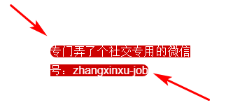
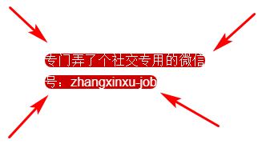

# `CSS3`盒相关样式

## 1.`box-sizing`盒模型

- content-box
- border-box

`box-sizing:content-box`   标准盒模型

`box-sizing:border-box`   IE盒模型

## 2.盒子阴影

```css
box-shadow:inset 0px 0px 40px 2px gray;
```

- 第一个值：inset表示阴影是显示在盒⼦内部。如果不设置，则默认显示在盒⼦外部。
- 第二个值：x方向的`offset`
- 第三个值：y方法的`offset`
- 第四个值：模糊半径
- 第五个值：放大阴影。 正值表示放大，负值表示缩小。
- 第六个值：阴影的颜色。
  注意： `box-shadow` 也可以像 `text-shadow` 一样，使用逗号分隔同时设置多个阴影。

## 3.圆角`border-radius`

```css
div{
    border-top-left-radius: 10px;
    border-top-right-radius: 10px;
    border-bottomright-radius: 10px;
    border-bottom-left-radius: 10px
}
```

在线工具:<http://westciv.com/tools/gradients/>

## 4.边框图片

`border-image`

- `border-image-source` ⽤在边框的图⽚的路径。

- `border-image-slice` 图⽚边框向内偏移。

  表示的在把边框图⽚进⾏分割为9宫格时候的偏移量。

  属性值不带单位

- `border-image-width` 图⽚边框的宽度。

  如果这个值超过了`border-image-width`, 则边框图⽚会被拉伸, 如果⼩于, 则会被压缩.
  ⼀般设置为与`border-image-slice`的属性的值相等.

  **值对 border 的宽没有任何的影响, 换句话说, 对元素的尺⼨没有任何的影响.**

- `border-image-outset` 边框图像区域超出边框的量。负值无效,一般不设置.

- `border-image-repeat` 图像边框是否应平铺( `repeat` )、铺满( `round`)或拉伸( `stretch` )、默认`space`。

**注意:要想`border-image` 能够⽣效, 则 `border-width` 不能为 0 和 `border-style` 的值不能是`none`**

简写

```css
/* source | slice */
border-image: linear-gradient(red, blue) 27;
/* source | slice | repeat */
border-image: url("/images/border.png") 27 space;
/* source | slice | width */
border-image: linear-gradient(red, blue) 27 / 35px;
/* source | slice | width | outset | repeat */
border-image: url("/images/border.png") 27 23 / 50px 30px / 1rem round space;
```

书写的时候要注意他们的顺序. 由于`outset`和`width`的相似性, 所以`outset`必须在`width`之后.
`slice, width, outset` 之间要使⽤ / 来隔开

## 5.背景相关属性

`background-size`   图片不会失真

```css
div{
    background-size: contain;   /*完整显示图片,图片优先*/
    background-size: cover;    /*填满父容器,多余图片被裁剪*/
    background-size: 100px 100px;   /*缩放成指定大小*/
}
```

`background-origin`

- `padding-box` 背景图像相对于内边距框来定位。
- `border-box` 背景图像相对于边框盒来定位。默认值
- `content-box` 背景图像相对于内容框来定位.

`background-clip`

规定背景图片的裁剪在父容器内的裁剪位置,**属性值同上**

```css
div{
    margin: 100px;
    width: 400px;
    height: 2000px;
    border: 20px dashed #000;
    padding: 30px;
    background: red url("6.jpeg") no-repeat -400px;
    background-origin: padding-box;
    background-clip: content-box;
}
```

`backgroundPosition`

`background-attachment:fixed;`固定背景不动

## 6.`box-decoration-break`

CSS `box-decoration-break`属性可以指定元素片段在跨行、跨列或跨页（如打印）时候的样式渲染表现。

默认情况下，元素的跨行或跨列渲染都是裁剪分割，各得一部分。

修改前效果:


修改后效果:


代码:

```css
.box { width: 200px; color: #fff; }
.text {
  border-radius: 30px; background-color: #cd0000;
  box-decoration-break: clone;/*添加的代码*/
}
```

语法:

```css
box-decoration-break: slice;  /* 默认值 */
box-decoration-break: clone;
```

**slice**
slice是切片，分割的意思。默认值。表示各个盒子断开的部分如同切割开一般。

**clone**
clone是克隆，独立的意思。表示断开的各个盒子样式独自渲染。

只能影响部分CSS的渲染:

- background
- border
- border-image
- box-shadow
- border-radius
- clip-path
- margin
- padding
