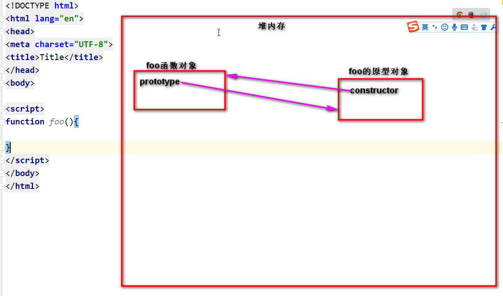
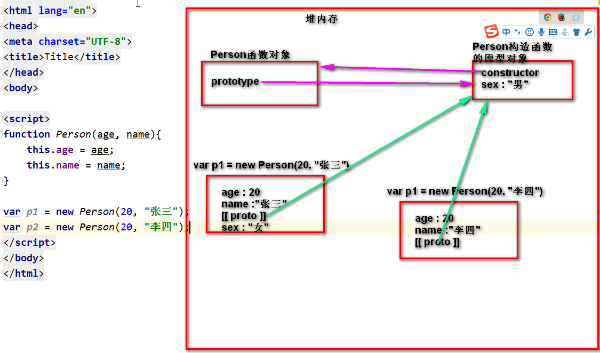

# 原型

**在`js`中一切皆对象!**

```JavaScript
var a = { }
var b = new Object()
var c = 1;
var d= true;// new Boolean(true)
d.toString()
```

- 对于基本类型的数据, `js`提供了相应的包装类型, 有了包装类型, 基本类型的数据也可以当做对象来使用.
- 只要是对象, 就一定可以有方法和属性.

---

```JavaScript
function foo(){

}
```

函数也是对象.

**既然函数是对象了, 函数也会有自己的属性和方法.**

1.函数声明成功,会自动完成下面的图示



2.虽然任何的函数都有原型对象, 但是在实际使用的过程中, 我们只关心构造函数的原型, 普通函数的原型我们不关心,因为他没有任何的用处.



---

## 原型和原型链


## 通过原型创建对象

1. 把独有的数据属性放在对象上
2. 把方法放在原型上
   - 因为对每个对象来说, 方法内的代码是完全一样的. 应该把这些共享的东西放在原型上.
3. 使用构造函数创建对象除了我们自己添加的属性还有自动添加的一个不可见的属性`[[proto]]`,这个属性会指向构造函数的原型对象.

## 组合模式创建对象

1. 把数据属性放在具体的对象上.(在构造函数中使用`this.xxxx=xxx`)
2. 把方法添加到原型上.

## 替换原型法

```JavaScript
function Foo(){

}
Foo.prototype = {
    constructor : Foo,
    speak : function(){

    }
}
```
